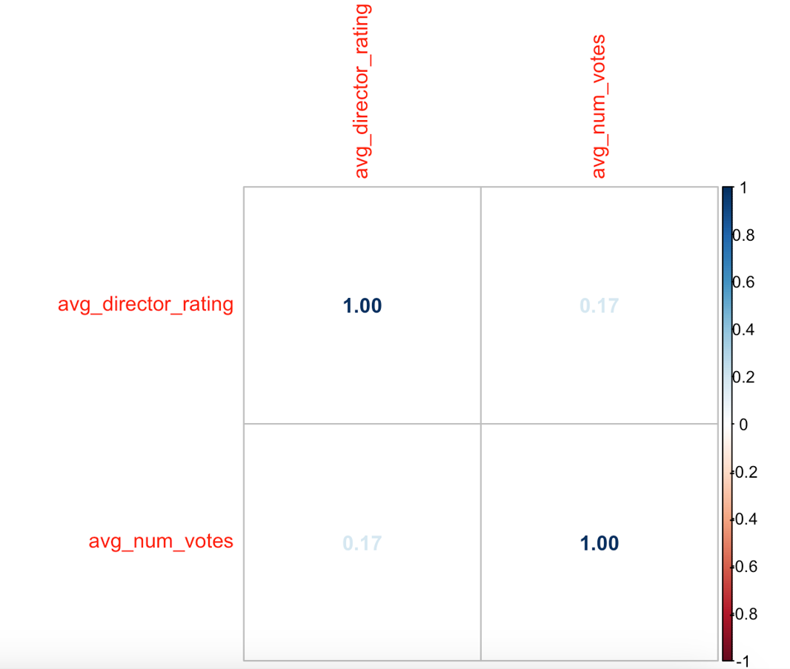

# Data Preparation Team Project on Director's Impact on Movie Ratings

## Introduction
Are directors listed in the top 100 more likely to receive higher average ratings compared to those who are not listed, and is there a correlation between the average ratings of movies directed by a director and the average number of votes those movies receive?

This research investigates the impact of a director's renown on movie ratings and audience engagement. We explore whether high-profile directors consistently produce higher-rated movies and examine how these ratings correlate with viewer votes. Additionally, we consider how various factors might influence the relationship between a director's reputation and their movie's success. Our goal is to shed light on the dynamics at play between directorial fame, movie ratings, and audience participation, providing insights into the broader implications for the film industry.

## Motivation
The oscars are always overloaded with rumours about which famous director will win the prices that year. However, does a good director always result in a high rating of a movie? Is this rating biased on the director, or does a good director also receives low ratings for some of his movies? For this questions, the IMDb ratings data set can provide valuable insides. This data will be combined with the director of the movies to observe if any trends/effects can be find. This could provide valuable insides in the film industry and for large film houses. After analysing these trends/effects it will be analyzed why these treds/effects take place.

## Method and results

### Methods
Our approach involves detailed data preparation, including downloading, cleaning, merging, and analyzing data to examine the correlation between directors and movie ratings. We utilize R for statistical modeling, employing linear regression, ANOVA, and logistic regression analyses to dissect the influence of directors, considering variables such as movie genres and audience reception.

### Results

## Scatter Plot: Ratings vs. Votes for Directors
This scatter plot compares directors' average movie ratings with the number of votes they receive, highlighting popularity versus quality.


## Rating Trends: Top 100 Directors
The line graph depicts rating trends across the top 100 directors, showing a potential correlation between a director's ranking and their average ratings.


## Histogram: Distribution of Director Ratings
A histogram showing the distribution of average ratings for directors, revealing the most common rating ranges.


## Jittered Plot: Rating Distribution
This jittered scatter plot displays the distribution of ratings among directors, avoiding overlap for clearer visualization.


## Correlation Matrix: Ratings and Votes
A matrix displaying the correlation between directors' average ratings and the average number of votes, providing insight into the relationship between the two metrics.


## Detailed Scatter: Ratings vs. Number of Votes
A detailed scatter plot showing the relationship between average director ratings and the number of votes, offering a granular view of the data.


## Repository overview

```
├── data                  
├── images
├── gen
│   ├── analysis           
│   ├── data-preparation   
│   └── paper              
└── src
    ├── analysis           
    ├── data-preparation   
    └── paper 
├── .gitignore
├── LISENCE
├── README.md
└── makefile

```
          

## Running instructions

To conduct our analysis, ensure R is installed along with the tidyverse package, which includes 'dplyr', 'ggplot2', 'readr', and 'stringr' libraries. Start by executing `src/data-preparation/download_data.R` for data download. Follow the Makefile in `src` to sequentially process data preparation, analysis, and paper compilation steps.

For detailed environment setup instructions, refer to [Tilburg Science Hub](https://tilburgsciencehub.com/):  

- **R Setup:** Visit the [R and RStudio Installation Guide at Tilburg Science Hub](https://tilburgsciencehub.com/topics/computer-setup/software-installation/rstudio/r/) for a comprehensive guide.
- **Make Setup:** Check out [Set up Make at Tilburg Science Hub](https://tilburgsciencehub.com/topics/automation/automation-tools/makefiles/make/) to streamline workflows.

### Running The Code By Make

To execute the analysis, please follow these instructions:

1. **Fork and Clone the Repository:**  
   Fork this repository to your GitHub account.
   Open your command line/terminal and clone the repository to your local machine using:  
   `git clone https://github.com/course-dprep/team-project-dprep_group3`

2. **Set Your Working Directory:**  
   Change your working directory to the cloned repository:  
   `cd team-project-dprep_group3`

3. **Open Command Prompt as Administrator:**  
Go to your search bar, type "cmd", then right-click on Command Prompt and select "Run as administrator." It's important to run the Makefile as administrator to ensure that PANDOC has the necessary permissions.


3. **Run the Makefile:**
Execute the following command in your terminal:  


    `make`    


This command will start the data preparation, analysis, and compilation steps defined in the Makefile. It will generate analysis outputs, including cleaned datasets, statistical models, and visualizations.

4. **View the Analysis Output:** 
Upon successful completion, check the specified output directories for graphs, summary statistics, and other analytical insights generated by the code.

5. **Clean Up:**  
To remove all raw and intermediate data files created during the analysis, ensuring that only the final outputs and source code remain, run:  


    `make clean`


## More resources

For further reading on the impact of directors on movie ratings and the film industry's dynamics, the following resources can be incredibly valuable:

- **IMDb Datasets Documentation:** Explore the comprehensive datasets offered by IMDb for in-depth movie analytics. [IMDb Datasets](https://developer.imdb.com/non-commercial-datasets/)
- **Box Office Mojo:** For insights into movie financials and how different movies perform at the box office, including those directed by top-rated directors. [Box Office Mojo](https://www.boxofficemojo.com/)


## About

This project is a collaboration by master's students at Tilburg University, developed within a Data Preparation course, aiming to illuminate the factors that influence movie ratings with a particular emphasis on the role of directors.

Busenaz Atahan, b.atahan@tilburguniversity.edu 


Sila Bozoglu, s.bozoglu@tilburguniversity.edu  


Jesse Dekker, j.g.a.a.l.dekker@tilburguniversity.edu  


Jennicka Wijma, j.a.j.wijma@tilburguniversity.edu  


Boris Willekens, b.w.m.willekens@tilburguniversity.edu  


